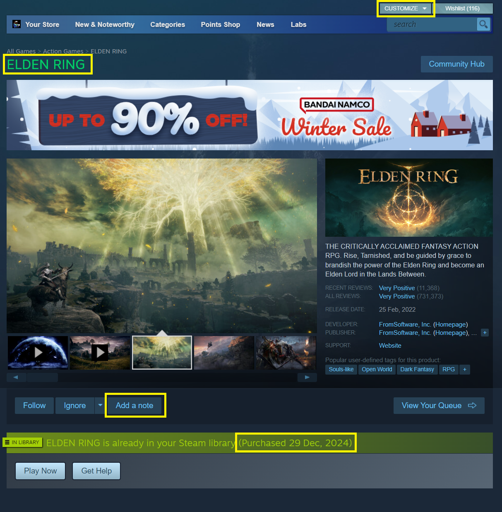
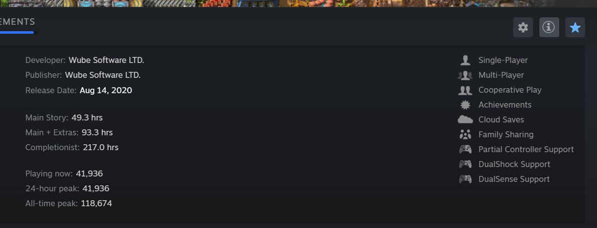
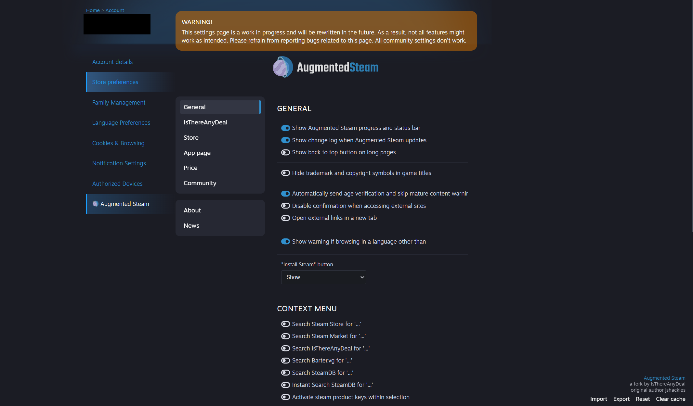

# Augmented Steam Plugin for Millennium
This plugin ports the functionality of the [Augmented Steam Browser Extension](https://github.com/IsThereAnyDeal/AugmentedSteam) to the Steam client using Millennium. 

## Features

> Pretty much all the Augmented Steam extension's features are included in this plugin.

See the [AugmentedSteam Browser Extension](https://github.com/IsThereAnyDeal/AugmentedSteam) for more details about
each feature or the [extension page](https://augmentedsteam.com/).  
Also some features from the extension ported to the library see
[Library extra details](#extra-library-details)

## Installation

1. Ensure you have [Millennium](https://github.com/shdwmtr/millennium) installed on your Steam client
2. Download the [latest release](https://github.com/tddebart/AugmentedSteam-Extension-Plugin/releases) of this plugin
3. Place the plugin files in your Millennium plugins directory (should be a plugins folder in your Steam client
   directory)
4. Restart your Steam client
5. Enable the Augmented Steam plugin in the Millennium plugin menu
6. FULLY restart the Steam client again

## Usage

Once installed it should just work out of the box.
 
To see if the plugin is working you can go to any store app page and look for the newly added features (highlighted in
yellow)

## Configuration

To configure the plugin:

1. Open Steam and navigate to the main store page
2. Click on "Your Store" in the top menu, then select "Preferences"
    2.5. Or just click on your profile top right, then Account details
3. Look for the "Augmented Steam" button and click it

Alternatively, you can access the options page directly by entering this URL in your Steam client:  
https://store.steampowered.com/account/?augmented-steam=true

Here you can customize various features and behaviors of the Augmented Steam plugin to suit your preferences. Just like
in the
browser extension.

## Images

#### Store

### Extra library details

After clicking on the (i) in the library you will now also see the HowLongToBeat times and player count in the game
details

#### Options page

## Contributing

Contributions are welcome! Please feel free to submit a Pull Request.

## Credits

- Original Augmented Steam Extension: [AugmentedSteam](https://github.com/IsThereAnyDeal/AugmentedSteam)
- [Millennium](https://github.com/shdwmtr/millennium)

## License

This project is licensed under the MIT License - see the [LICENSE](LICENSE) file for details.

